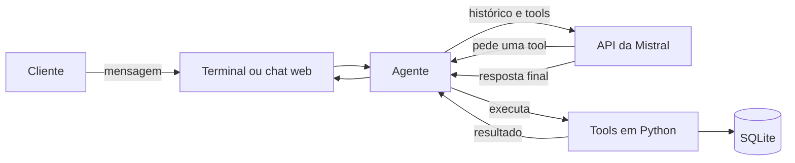

# Sabor & Arte: assistente de restaurante com Mistral

Agente conversacional para atendimento de restaurante. O cliente escreve em linguagem natural e o assistente consulta o cardápio, informa horários, verifica mesas e cria, consulta ou cancela reservas.

Funciona de duas formas: no **terminal** e em uma **interface web** que também pode ser colocada no site do próprio restaurante.

<!-- Adicione aqui um print ou GIF da conversa:

-->

## Como funciona

O modelo da Mistral não acessa o banco de dados. Ele decide **qual função chamar**, e o código Python valida e executa a ação. As regras do restaurante (dias fechados, mesas disponíveis, reserva duplicada) ficam no código, não no prompt.



1. O cliente envia uma mensagem.
2. O agente monta o contexto: instruções do sistema (com data e calendário atuais), histórico da conversa e a nova mensagem.
3. A Mistral responde direto ou pede uma tool.
4. Se pediu uma tool, o Python executa e devolve o resultado ao modelo.
5. O ciclo repete até o modelo produzir a resposta final, com um limite de iterações.

## Tools disponíveis

| Tool | O que faz |
|---|---|
| `consultar_cardapio` | Lista categorias e pratos |
| `consultar_preco` | Preço de um item |
| `consultar_horario` | Horário de funcionamento |
| `consultar_disponibilidade` | Verifica mesas para data, horário e número de pessoas |
| `criar_reserva` | Cria uma reserva |
| `consultar_reserva` | Consulta uma reserva existente |
| `cancelar_reserva` | Cancela, mas só depois de o cliente confirmar explicitamente |

As definições ficam em `app/tools/definitions.py` e a ligação com as funções reais em `app/tools/registry.py`.

## Requisitos

- Python 3.10 ou superior
- Uma chave da API da Mistral (o plano gratuito **Experiment** serve)

### Como criar a chave

1. Crie uma conta em [console.mistral.ai](https://console.mistral.ai).
2. Escolha o plano Experiment. Ele pede verificação por telefone.
3. Vá em **API Keys** e clique em **Create new key**.
4. Copie a chave na hora: ela não é exibida de novo.

No plano gratuito, as requisições podem ser usadas para treinar os modelos da Mistral. Não envie dados sensíveis.

## Instalação

### Windows (PowerShell)

```powershell
git clone https://github.com/jaovcodes/restaurant-agent.git
cd Projeto_Mistral
python -m venv .venv
.\.venv\Scripts\Activate.ps1
python -m pip install --upgrade pip
pip install -r requirements.txt
copy .env.example .env
```

Se o PowerShell bloquear a ativação do ambiente virtual, rode `Set-ExecutionPolicy -Scope Process RemoteSigned` e ative de novo.

### macOS e Linux

```bash
git clone https://github.com/jaovcodes/restaurant-agent.git
cd Projeto_Mistral
python3 -m venv .venv
source .venv/bin/activate
pip install -r requirements.txt
cp .env.example .env
```

### Configurar o `.env`

Abra o `.env` e preencha, sem aspas e sem espaços ao redor do `=`:

```
MISTRAL_API_KEY=sua_chave_aqui
MISTRAL_MODEL=ministral-8b-2512
DURACAO_RESERVA_MINUTOS=90

# Opcionais (interface web)
EXIBIR_TOOLS=0
ORIGENS_PERMITIDAS=
```

### Popular o banco de dados

O banco SQLite (`restaurante.db`) é criado na primeira execução, mas começa **vazio**. Sem dados, o assistente responde que o cardápio está vazio e que o restaurante está fechado todos os dias. Rode o seed uma vez:

```
python -m app.seed
```

## Escolhendo o modelo

Nem todo modelo está disponível em todas as contas, e os limites de uso variam por modelo.

| Erro | Significado | O que fazer |
|---|---|---|
| `403 tier_not_allowed` | O modelo não está liberado no seu plano | Escolha outro modelo |
| `429 rate_limited` | Limite de requisições do modelo | Espere alguns minutos ou troque de modelo |

O agente faz mais de uma chamada por mensagem quando usa tools, então modelos com limites baixos esgotam mais rápido. Em testes com uma conta gratuita, o `mistral-small-latest` retornou 429 enquanto o `ministral-8b-2512` respondeu normalmente. Teste os modelos da sua conta e use um que funcione com tools.

## Uso

### Terminal

```
python -m app.cli
python -m app.cli --debug    # mostra as tools chamadas em cada resposta
```

Exemplos de conversa:

- "Quanto custa o risoto?"
- "Me mostra o cardápio de entradas"
- "O restaurante abre no sábado?"
- "Quero reservar para 4 pessoas na sexta às 20h"
- "Consulta a reserva do João"
- "Cancela a reserva 12"

### Interface web

```
uvicorn app.api:app --reload
```

Abra `http://127.0.0.1:8000`. A documentação interativa da API fica em `http://127.0.0.1:8000/docs`.

Com `EXIBIR_TOOLS=1` no `.env`, cada resposta ganha um painel "consultas ao sistema" com as tools chamadas. É a versão web do `--debug`, útil em demonstrações.

> Não rode o terminal e o servidor web ao mesmo tempo com a mesma chave: eles dividem o mesmo limite de requisições.

## Colocando o chat no site do restaurante

O chat é um componente independente (`app/static/chat.js`). Ele usa Shadow DOM, então o CSS do site não altera o chat e vice-versa.

**1. Deixe o servidor acessível pela internet**, de preferência com HTTPS. O site só carrega o script e conversa com esse servidor.

**2. Autorize o domínio do site** no `.env` do servidor. Sem isso, o navegador bloqueia as chamadas:

```
ORIGENS_PERMITIDAS=https://www.seurestaurante.com.br
```

**3. Cole no HTML do site**, antes do `</body>`:

```html
<script src="https://SEU-SERVIDOR/static/chat.js"
        data-api="https://SEU-SERVIDOR" defer></script>
```

Aparece um botão "Reservas e cardápio" no canto da tela, que abre o chat.

Para embutir o chat dentro de uma área da página, em vez do botão flutuante:

```html
<div id="sabor-arte-chat" style="height: 600px"></div>
<script src="https://SEU-SERVIDOR/static/chat.js"
        data-api="https://SEU-SERVIDOR"
        data-modo="embutido" data-alvo="#sabor-arte-chat" defer></script>
```

| Atributo | Descrição | Padrão |
|---|---|---|
| `data-api` | Endereço do servidor | mesmo domínio da página |
| `data-modo` | `flutuante` ou `embutido` | `flutuante` |
| `data-alvo` | Seletor do elemento, no modo embutido | `#sabor-arte-chat` |
| `data-nome` | Nome exibido | `Sabor & Arte` |

## API

### `POST /chat`

Requisição:

```json
{ "mensagem": "Quero ver o cardápio", "session_id": null }
```

Resposta:

```json
{
  "resposta": "Aqui está o cardápio: ...",
  "session_id": "9f2c1e...",
  "tools": [],
  "erro": false
}
```

- Na primeira mensagem, envie `session_id` como `null` e reutilize o valor devolvido nas seguintes. Cada `session_id` tem seu próprio histórico.
- A mensagem tem no máximo 1000 caracteres.
- `tools` só vem preenchido com `EXIBIR_TOOLS=1`.
- `erro: true` indica que `resposta` é uma mensagem de falha, já pronta para exibir ao cliente.

### `GET /saude`

Retorna `{"status": "ok"}`.

## Estrutura do projeto

```
Projeto_Mistral/
├── app/
│   ├── agent/
│   │   ├── agent.py            # loop de function calling
│   │   ├── memory.py           # histórico por sessão
│   │   ├── mistral_client.py   # chamada à API da Mistral
│   │   └── prompts.py          # system prompt com data e calendário atuais
│   ├── tools/
│   │   ├── cardapio.py
│   │   ├── horarios.py
│   │   ├── reservas.py
│   │   ├── definitions.py      # descrição das tools para o modelo
│   │   └── registry.py         # liga cada tool à sua função
│   ├── static/
│   │   ├── chat.js             # componente de chat (flutuante ou embutido)
│   │   └── index.html          # página completa
│   ├── api.py                  # API FastAPI
│   ├── cli.py                  # chat no terminal
│   ├── config.py
│   ├── database.py
│   ├── models.py
│   ├── schemas.py
│   └── seed.py                 # popula o banco
├── .env.example
├── requirements.txt
└── README.md
```

## Banco de dados

SQLite, criado localmente em `restaurante.db`. Modelos (em `app/models.py`): `Cardapio`, `Horario`, `Mesa` e `Reserva`.

## Antes de publicar na internet

- **Custo:** qualquer visitante consome a sua cota da Mistral. Limite mensagens por sessão ou por IP.
- **Privacidade:** se a consulta de reservas funcionar só com o nome do cliente, qualquer visitante pode ver reservas de outras pessoas. Exija também o número da reserva.
- **Painel de tools:** mantenha `EXIBIR_TOOLS=0`. Ele mostra argumentos e resultados internos.
- **Memória:** o histórico das conversas fica na RAM do servidor e some ao reiniciar.
- **Banco:** alguns serviços de hospedagem gratuitos apagam o SQLite a cada deploy. Rode o seed na inicialização se for o caso.

## Solução de problemas

| Sintoma | Causa provável | Solução |
|---|---|---|
| `ModuleNotFoundError: No module named 'dotenv'` | Ambiente virtual inativo ou dependências não instaladas | Ative o venv e rode `pip install -r requirements.txt` |
| `MISTRAL_API_KEY não definida` | `.env` ausente, fora da raiz ou salvo como `.env.txt` | Confira o nome e o local do arquivo |
| `401` | Chave inválida ou conta não ativada | Gere uma nova chave e confira o plano no console |
| `403 tier_not_allowed` | Modelo fora do seu plano | Troque `MISTRAL_MODEL` |
| `429 rate_limited` | Limite de requisições | Espere ou troque de modelo |
| Cardápio vazio, "fechado todos os dias" | Banco sem dados | Rode `python -m app.seed` |
| `RuntimeError: Directory 'app/static' does not exist` | Pasta `static` ausente ou no lugar errado | Ela deve ficar dentro de `app/` |
| `Address already in use` | Porta 8000 ocupada | `uvicorn app.api:app --reload --port 8001` |
| O chat abre no site, mas não responde | Domínio não autorizado (CORS) | Adicione o domínio em `ORIGENS_PERMITIDAS` |
